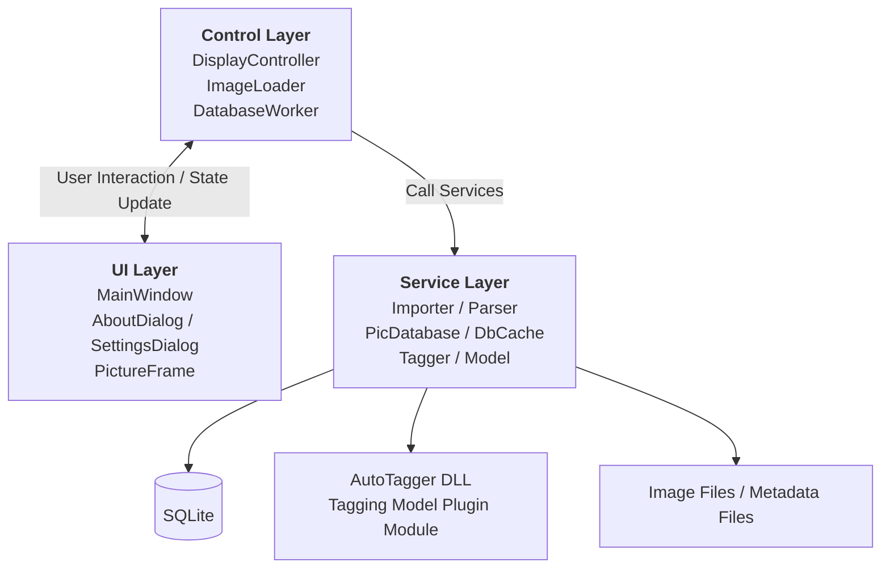
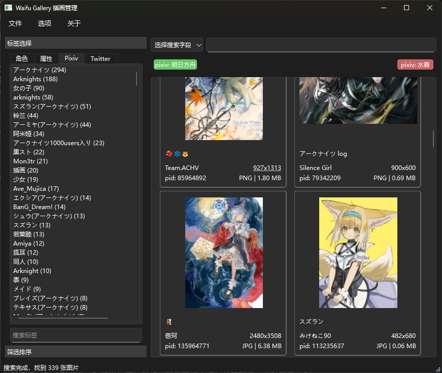
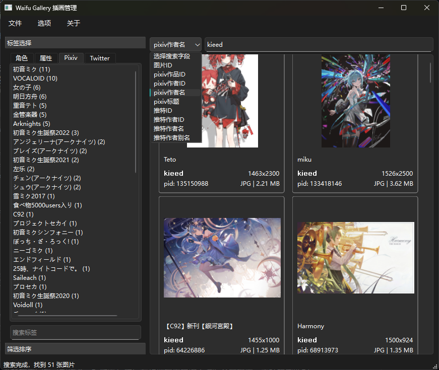
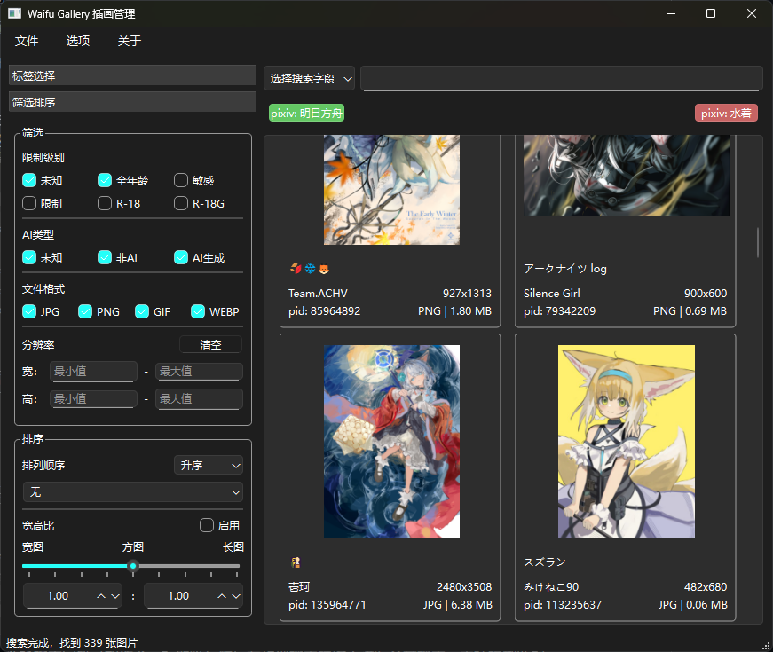
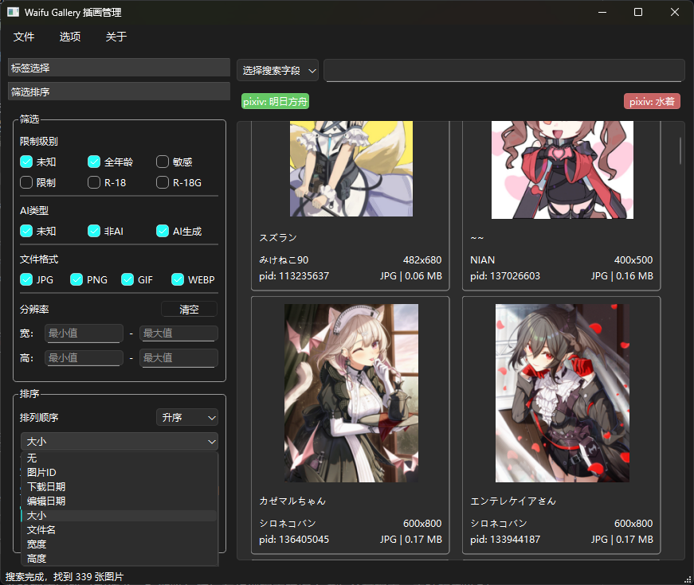

# Waifu Gallery

[](https://www.gnu.org/licenses/gpl-3.0)
[](https://en.cppreference.com/w/cpp/17)
[](https://www.qt.io/)
[](https://sqlite.org/)

Language: [English](./README-en.md) | [中文](./README.md)

A powerful anime illustration management system that provides advanced tag search, filtering, and sorting functions, making image management easy and simple.

## Project Background

I often browse platforms like Pixiv and Twitter, and save illustrations I like. As my collection of images grew, managing and finding them became inconvenient, and it was hard to quickly find the images I wanted. Therefore, I developed this tool to solve this problem.

## Project Introduction

Waifu Gallery is a desktop application developed based on Qt6, specifically designed for managing anime illustrations. It supports multiple image formats, can efficiently manage large numbers of images, and provides practical search, filtering, and sorting functions to help you better organize and browse your illustration collection.

## Main Features

### Format Support
- Supports common image formats: JPG, PNG, GIF, WebP
- Compatible with images, crawl results, and metadata downloaded by [powerful pixiv downloader](https://github.com/xuejianxianzun/PixivBatchDownloader)
- Compatible with Twitter images and metadata downloaded by [gallery-dl](https://github.com/mikf/gallery-dl)

> 💡 **Practical Tips** 💡
> How to enable the downloader's metadata saving function?
> - In [powerful pixiv downloader](https://github.com/xuejianxianzun/PixivBatchDownloader), go to `More - Crawl`, enable `Automatically export crawl results`, set `Crawl results > 0`, and select `JSON` or `CSV` for `File format` (`JSON` is more recommended). Or in `More - Download`, check the `Illustration` option under `Save work metadata`.
> - In [gallery-dl](https://github.com/mikf/gallery-dl), use the `--write-metadata` option to enable metadata saving.

### Search Function
- Supports automatic image tag annotation (under development), Pixiv tag, and Twitter tag search
- Supports multi-tag combined search, including and excluding specific tags
- Provides full-text search for fields such as author name, work title, tweet ID, and image ID (requires downloader metadata support)

### Filtering and Sorting
- Can filter by restriction level, file type, and resolution
- Supports sorting by file size, creation time, aspect ratio, and other conditions

### Automatic Tag Classification
- Deep learning-based automatic image tag classification, which can automatically annotate images with tags such as character, scene, and style

### Similarity Search
- Based on the image feature hash output by the model, similarity search can be performed on images to find duplicate or similar images

## Tech Stack

- **Language**: C++ 17
- **GUI**: Qt 6
- **Database**: SQLite 3
- **Build**: CMake / vcpkg / MSVC
- **Third-party Libraries**: xxHash, stb_image, libwebp, nlohmann/json, rapidcsv, OpenCV, ONNX Runtime

## Project Scale

- About 40 C++ source files, about 5400 lines
- 11 database tables, including foreign keys and indexes
- Automatic tag classification, including 9176 tags

## Architecture

MVC + producer-consumer thread pool + modular plugin



## Technical Highlights

### 1. Asynchronous Image Loading and Custom LRU Cache

Uses a thread pool to asynchronously load images and a custom LRU cache for images, preventing image decoding from blocking the UI thread and improving interface responsiveness.

- Uses a thread pool to load and decode images, the main thread is not blocked, and multiple threads decode images in parallel
- Manually implements an LRU cache, using an array-based doubly linked list + hash table, avoiding frequent new/delete
- Delivers loading completion events back to the main thread through `QEvent`, avoiding cross-thread UI operations
- Scales images to display size during decoding, avoiding full-image decoding and saving memory and CPU resources

### 2. UI Virtualization and Widget Pool

Uses virtual scrolling and only creates widgets within the visible area, preventing excessive memory usage caused by creating a large number of widgets at once

- Only creates image widgets near the viewport, dynamically displays/recycles them during scrolling, reducing memory usage
- Uses a widget pool to reuse already-created widgets, avoiding frequent memory allocation and widget destruction
- Recalculates positions according to the new number of columns when the window is resized, keeping the user's current browsing position from jumping

### 3. Multi-threaded Import Pipeline

Implements a multi-threaded import pipeline to improve import efficiency, achieving an 8-10x speed increase compared to single-threaded import.

- Producer-consumer model: multiple worker threads parse files, a single thread writes to the database, avoiding database write lock contention
- Supports canceling import tasks during import, automatically rolling back uncommitted transactions, ensuring no half-finished products remain in the database

### 4. Image File Header Parsing

Manually implements image file header parsing to directly obtain image resolution, avoiding full-image decoding and improving import speed.

- Parses JPEG, PNG, GIF, and WebP file headers by itself to obtain resolution
- Avoids full-image decoding, significantly improving the import speed of large numbers of files
- Falls back to complete decoding with third-party libraries when parsing fails

### 5. Plugin-based Image Classification Model

Through plugin-based design, the image classification model is decoupled from the main program.

- Uses a DLL plugin architecture to decouple the model from the main program, allowing different models to be replaced without recompiling the main program
- The main program and model module share an abstract interface, and the main program dynamically loads the tag classification model at runtime
- Deep learning inference backend based on ONNX Runtime, supporting DirectML (GPU) and automatic CPU fallback
- Two-stage pipeline: multi-threaded preprocessing + single-threaded inference, improving inference efficiency
- Manually modifies the model computation graph and adds a PCA-ITQ layer, compressing 4096-dimensional floating-point feature vectors into 512-bit binary codes for image similarity retrieval
- For model details, see [onnx-deepdanbooru](https://github.com/R4nd5tr/onnx-deepdanbooru)

## Usage Guide

### 1. **Import Images**:
 - In the menu bar, click `File - Import Non-downloader Images...`, select a folder containing ordinary images or images not downloaded by a downloader, and the program will automatically scan and import them.
 - Click `File - Import Files Downloaded by Powerful Pixiv Downloader...`, select a folder containing images or metadata downloaded by [powerful pixiv downloader](https://github.com/xuejianxianzun/PixivBatchDownloader), and the program will use a dedicated parser to parse file names and metadata files, importing information such as tags and authors.
 - Click `File - Import Twitter Files Downloaded by gallery-dl...`, select a folder containing Twitter images or metadata downloaded by [gallery-dl](https://github.com/mikf/gallery-dl), and the program will similarly use a dedicated parser to import related content.

This tool supports all anime illustrations. If images have downloader metadata, they can be searched and filtered by more dimensions such as platform tags, authors, and work titles.

> [!IMPORTANT]
> - When using a dedicated parser to import images downloaded by a downloader, please be sure to ensure that the selected folder **only contains files downloaded by that downloader**, and do not mix in other files.
> - When importing ordinary images, please be sure to ensure that the selected folder **only contains supported image files**, and do not mix in other files.
>
> Mixing in other files may cause program abnormalities or data loss.

### 2. **Tag Search**:
   Clicking a tag in the left tag bar includes that tag, while double-clicking excludes it. Included tags are displayed in green, and excluded tags are displayed in red.
   
   Clicking a selected tag cancels the selection. Multi-tag combined search is supported. After the search is completed, the tags that can be further selected are automatically updated. The number in parentheses after a tag indicates the number of images containing that tag.
   

### 3. **Text Search**:
Select a search field (such as author, title, etc.) and then enter text in the top search bar for full-text search. Fuzzy matching is supported.
   

### 4. **Filter Images**:
Use the filtering conditions and sorting options in the sidebar to quickly find the target images
   
   
   
### 5. **Quick Access**:
You can quickly access related content by clicking image information
   - Click the image resolution to open the image with the system's default image viewer
   - Click the image format and size to open the file location
   - Click the author name to open the corresponding author's homepage in a browser
   - Click the work ID to open the corresponding work page in a browser

### 6. **Image Preview**:
   - When the mouse hovers over an image, an enlarged preview image is displayed, making it convenient to view image details.
   - When previewing multiple images, scrolling the mouse wheel can switch the previewed image, while also displaying the information of the currently previewed image.

### 7. **Automatic Tag Classification**:
   - If you want to use the automatic tag classification function, please download the latest `onnx-deepdanbooru` model and inference module from [onnx-deepdanbooru](https://github.com/R4nd5tr/onnx-deepdanbooru), and place them in the `model` folder under the program root directory.
   - GPU-accelerated inference requires the computer to support and have DirectX 12 installed. If GPU acceleration is not supported, the program will use the CPU for inference, which will be slower.
   - In the menu bar, click `File - Start Automatic Tag Classification`, and the program will use the deep learning model to automatically annotate all imported images with tags such as character, scene, and style, and annotate the restriction level.
   - After annotation is completed, you can click the left tag bar to perform tag search, and the program will search according to the automatically annotated tags.

## Development and Build

This project is still under continuous development, and no official version has been released yet. If you want to participate in development or build the project yourself, please follow the steps below:

### Environment Requirements

- MSVC compiler
- Qt6 framework
- vcpkg package manager
- CMake build tool

### Get the Source Code

```bash
git clone https://github.com/R4nd5tr/waifu_gallery.git
cd waifu_gallery
```

### Build the Project

Modify the paths in the `CMakePresets.json.example` file to your environment paths, and rename it to `CMakePresets.json`.

Then run the following commands in the project root directory:
```bash
cmake --preset=msvc-release
cmake --build --preset=msvc-release-build
```
The compilation result will be in the `/bin` directory.

If you encounter the problem that the program crashes immediately upon opening, it may be due to missing some DLL files. You need to use the `windeployqt` tool to copy Qt dependencies. If there are still problems, please check whether DLL files downloaded by vcpkg are missing. These DLL files can be found in the `build/msvc/vcpkg_installed/x64-windows/bin` directory.

Use Qt6's `windeployqt` tool to copy the necessary Qt libraries to the output directory:
```bash
windeployqt <path-to-executable>
```

## Development Plan
- [ ] Image detailed information panel
- [ ] Favorites function
- [ ] Custom tag management
- [ ] Image batch operation function

## Open Source License

This project uses the **GNU GPL v3** open source license. For specific content, please refer to the [LICENSE.txt](LICENSE.txt) file.

## Related Projects
- [onnx-deepdanbooru](https://github.com/R4nd5tr/onnx-deepdanbooru) - Deep learning model module
- [powerful pixiv downloader](https://github.com/xuejianxianzun/PixivBatchDownloader) - Pixiv image download tool
- [gallery-dl](https://github.com/mikf/gallery-dl) - Social media image download tool