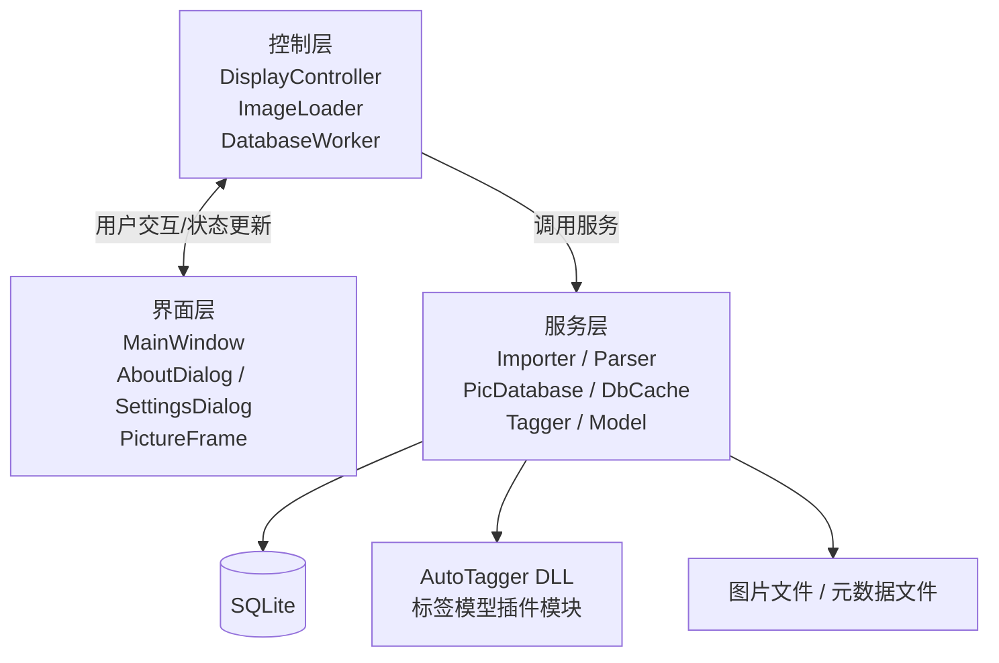

# Waifu Gallery

[](https://www.gnu.org/licenses/gpl-3.0)
[](https://en.cppreference.com/w/cpp/17)
[](https://www.qt.io/)
[](https://sqlite.org/)

Language: [English](./README-en.md) | [中文](./README.md)

一个功能强大的二次元插画管理系统，提供高级标签搜索、筛选和排序功能，让图片管理变得轻松简单。

## 项目背景

平时经常浏览 Pixiv、Twitter 等平台，看到喜欢的插画就会保存下来。随着收藏的图片越来越多，管理和查找变得不太方便，很难快速找到想要的图片。因此，我开发了这个工具来解决这个问题。

## 项目简介

Waifu Gallery 是基于 Qt6 开发的桌面应用程序，专门为管理二次元插画设计。支持多种图片格式，能够高效管理大量图片，并提供实用的搜索、筛选和排序功能，帮助你更好地整理和浏览插画收藏。

## 主要功能

### 格式支持
- 支持常见图片格式：JPG、PNG、GIF、WebP
- 兼容 [powerful pixiv downloader](https://github.com/xuejianxianzun/PixivBatchDownloader) 下载的图片、抓取结果和元数据
- 兼容 [gallery-dl](https://github.com/mikf/gallery-dl) 下载的 Twitter 图片与元数据

> 💡 **实用提示** 💡
> 如何启用下载器的元数据保存功能？
> - 在 [powerful pixiv downloader](https://github.com/xuejianxianzun/PixivBatchDownloader) 中，进入`更多-抓取`，启用`自动导出抓取结果`，设置`抓取结果>0`，`文件格式`选择`JSON`或`CSV`（更推荐使用`JSON`）。或者在`更多-下载`中，勾选`保存作品的元数据`的`插画`选项。
> - 在 [gallery-dl](https://github.com/mikf/gallery-dl) 中，使用`--write-metadata`选项启用元数据保存。

### 搜索功能
- 支持自动标注图片标签、平台标签（如 Pixiv 标签和 Twitter 标签）搜索
- 支持多标签组合搜索，包含和排除特定标签
- 提供作者名称、作品标题，推文ID，图片ID等字段的全文搜索（需要下载器元数据支持）

### 筛选与排序
- 可按限制等级、文件类型、分辨率进行筛选
- 支持按文件大小、创建时间、宽高比等条件排序

### 自动标签分类
- 基于深度学习的图片自动标签分类，自动为图片标注角色，场景，风格等标签

### 相似度搜索
- 根据模型输出的图片特征哈希，可对图片进行相似度搜索，查找重复或相似图片

## 技术栈

- **语言**：C++ 17
- **GUI**：Qt 6
- **数据库**：SQLite 3
- **构建**：CMake / vcpkg / MSVC
- **第三方库**：xxHash、stb_image、libwebp、nlohmann/json、rapidcsv、OpenCV、ONNX Runtime

## 项目规模

- C++ 源码约 30 个文件，约 4000 行
- 数据库表 11 张，含外键与索引
- 自动标签分类，包含 9176 个标签

## 架构

MVC + 生产者-消费者线程池 + 插件化模块



## 技术亮点

### 1. 图片异步加载与自定义 LRU 缓存

采用线程池异步加载图片和自定义 LRU 缓存图片，防止图片解码阻塞 UI 线程，提升界面响应速度。

- 使用线程池加载和解码图片，主线程不阻塞，多线程并行解码图片
- 手动实现LRU缓存，使用数组双向链表 + 哈希表，避免频繁 new/delete
- 通过 `QEvent` 把加载完成事件投递回主线程，避免跨线程操作 UI
- 解码时缩放图片到显示尺寸，避免整图解码，节省内存和 CPU 资源

### 2. UI 虚拟化与控件池

使用虚拟滚动，只创建可见区域内的控件，防止一次性创建大量控件导致内存占用过高

- 仅创建视口附近的图片控件，滚动时动态显示/回收，减少内存占用
- 使用控件池复用已创建的控件，避免频繁分配内存和销毁控件
- 窗口缩放时按新列数重算位置，保持用户当前浏览位置不跳变

### 3. 多线程导入流水线

实现多线程导入流水线，提升导入效率，相较于单线程导入速度提升 8-10 倍。

- 生产者-消费者模型：多工作线程解析文件，单线程写数据库，避免数据库写入锁竞争
- 支持导入过程中取消导入任务，自动回滚未提交的事务，保证数据库不残留半成品

### 4. 图片文件头解析

手动实现了图片文件头解析，直接获取图片分辨率，避免整图解码，提高导入速度。

- 自行解析 JPEG、PNG、GIF、WebP 文件头获取分辨率
- 避免整图解码，大量文件导入速度显著提升
- 解析失败时回退到三方库完整解码

### 5. 插件化图片分类模型

通过插件化设计，实现图片分类模型与主程序解耦。

- 使用 DLL 插件架构将模型与主程序解耦，可替换不同的模型而无需重新编译主程序
- 主程序和模型模块共用抽象接口，主程序运行时动态加载标签分类模型
- 基于 ONNX Runtime 的深度学习推理后端，支持 DirectML (GPU) 与 CPU 自动回退
- 两级流水线：多线程预处理 + 单线程推理，提高推理效率
- 手动修改模型计算图并添加 PCA-ITQ 层，将 4096 维浮点数特征向量压缩成 512-bit 二值码，用于图像相似度检索
- 模型详见 [onnx-deepdanbooru](https://github.com/R4nd5tr/onnx-deepdanbooru)

## 使用指南

### 1. **导入图片**：  
 - 在菜单栏点击`文件-导入非下载器图片...`，选择包含普通图片或非下载器下载图片的文件夹，程序会自动扫描并导入。  
 - 点击`文件-导入Powerful Pixiv Downloader下载的文件...`，选择包含[powerful pixiv downloader](https://github.com/xuejianxianzun/PixivBatchDownloader)下载的图片或元数据的文件夹，程序会用专用解析器解析文件名和元数据文件，导入标签和作者等信息。
 - 点击`文件-导入gallery-dl下载的Twitter文件...`，选择包含[gallery-dl](https://github.com/mikf/gallery-dl)下载的Twitter图片或元数据的文件夹，程序同样会用专用解析器导入相关内容。  

本工具支持所有二次元插画，若图片带有下载器元数据，则可按平台标签、作者、作品标题等更多维度进行搜索和筛选。

> [!IMPORTANT]
> - 使用专用解析器导入下载器下载的图片时，请务必确保所选文件夹内**只包含该下载器下载的文件**，不要混入其他文件。
> - 导入普通图片时，请务必确保所选文件夹内**只包含支持的图片文件**，不要混入其他文件。
> 
> 如果混入其他文件可能导致程序异常或数据丢失。

### 2. **标签搜索**：
   单击左侧标签栏中的标签可包含该标签，双击则可排除，包含的标签显示为绿色，排除的标签显示为红色。
   
   点击已选中的标签可取消选择，支持多标签组合搜索，搜索完成后会自动更新可以进一步选择的标签，标签括号中的数字表示含有该标签的图片数量。
   

### 3. **文本搜索**：
选择搜索字段（如作者、标题等）然后在顶部搜索栏输入进行全文搜索，支持模糊匹配。
   

### 4. **筛选图片**：
使用侧边栏的筛选条件和排序选项，快速找到目标图片
   
   
   
### 5. **快捷访问**：
可以通过点击图片信息快速访问相关内容
   - 点击图片分辨率，使用系统默认图片查看器打开图片
   - 点击图片格式和大小，打开文件位置
   - 点击作者名称，使用浏览器打开对应的作者主页
   - 点击作品ID，使用浏览器打开对应的作品页面

### 6. **图片预览**：
   - 鼠标悬停在图片上时，会显示放大的预览图，方便查看图片细节。
   - 预览多个图片时，滚动鼠标滚轮可以切换预览的图片，同时显示当前预览的图片信息。

### 7. **自动标签分类**：
   - 如果想使用自动标签分类功能，请从[onnx-deepdanbooru](https://github.com/R4nd5tr/onnx-deepdanbooru)下载最新的`onnx-deepdanbooru`模型和推理模块，并将其放置在程序根目录下的`model`文件夹中。
   - GPU加速推理需要电脑支持并安装DirectX 12，若不支持GPU加速，程序将使用CPU进行推理，速度会较慢。
   - 在菜单栏点击`文件-开始自动标签分类`，程序会使用深度学习模型对所有已导入的图片自动标注角色、场景、风格等标签，并标注限制级别。
   - 标注完成后，你可以点击左侧标签栏进行标签搜索，程序会根据自动标注的标签进行搜索。

## 开发与构建

这个项目还在持续开发中，还没有发布正式版本。如果你想参与开发或自行构建项目，请按照以下步骤操作：

### 环境要求

- MSVC 编译器
- Qt6 框架
- vcpkg 包管理器
- CMake 构建工具

### 获取源码

```bash
git clone https://github.com/R4nd5tr/waifu_gallery.git
cd waifu_gallery
```

### 构建项目

修改 `CMakePresets.json.example` 文件中的路径为你的环境路径，并重命名为 `CMakePresets.json`。

然后在项目根目录下运行以下命令：
```bash
cmake --preset=msvc-release
cmake --build --preset=msvc-release-build
```
编译结果将在`/bin`目录下。

如果你遇到了打开程序直接闪退的问题，可能是缺少某些DLL文件，需要使用`windeployqt`工具复制Qt依赖，如果仍然有问题，请检查是否缺少vcpkg下载的DLL文件，在`build/msvc/vcpkg_installed/x64-windows/bin`目录中可以找到这些DLL文件。

使用Qt6的`windeployqt`工具将必要的Qt库复制到输出目录：
```bash
windeployqt <path-to-executable>
```

## 开发计划
- [ ] 图片详细信息界面
- [ ] 收藏夹功能
- [ ] 自定义标签管理
- [ ] 图片批量操作功能

## 开源协议

本项目采用 **GNU GPL v3** 开源协议，具体内容请参阅 [LICENSE.txt](LICENSE.txt) 文件。

## 相关项目
- [onnx-deepdanbooru](https://github.com/R4nd5tr/onnx-deepdanbooru) - 深度学习模型模块
- [powerful pixiv downloader](https://github.com/xuejianxianzun/PixivBatchDownloader) - Pixiv 图片下载工具
- [gallery-dl](https://github.com/mikf/gallery-dl) - 社交媒体图片下载工具